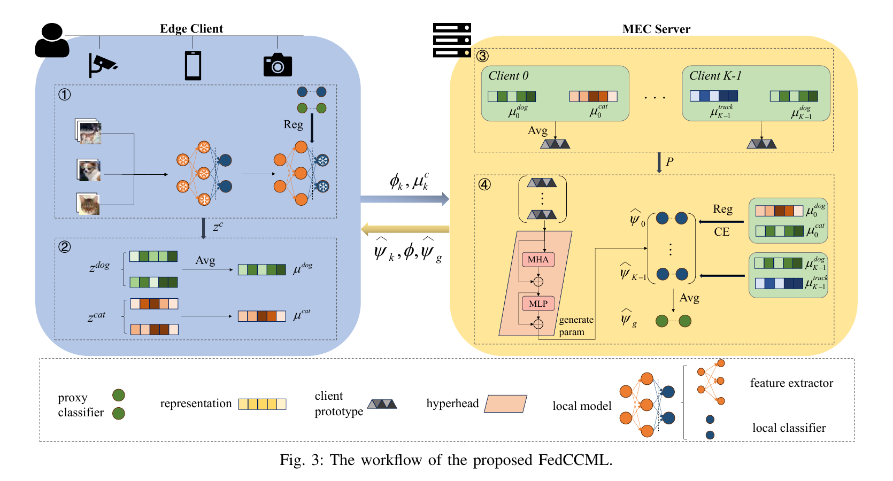

# FedCCML

This is the official PyTorch implementation of the upcoming SMC 2026 paper:

**FedCCML: Personalized Federated Learning with Classifier-Centric Mutual Learning**

FedCCML studies personalized federated learning under label skew and feature skew. The method decouples each model into a feature extractor and a classifier head. The server learns an attention-based hyperhead from uploaded class prototypes and generates personalized classifier heads, while clients use classifier-latent mutual learning to align features with local and proxy classifier directions.

## 🧩 Framework

<p align="center">
  
</p>

FedCCML contains two main modules.

### 🔗 Hyperhead-guided collaboration

The server collects class prototypes from all clients, builds one client prototype per client, and feeds the prototype matrix into a hyperhead. The hyperhead uses multihead attention and an MLP to generate personalized classifier heads.

### 🎯 Classifier-latent mutual learning

Each client first adapts its classifier head with cross-entropy loss. Then it freezes the classifier and trains the feature extractor with cross-entropy plus two cosine alignment terms, one from the local classifier and one from the proxy classifier.

Round 0 is evaluation only. The training loop then runs exactly `T` communication rounds, as described in the paper. The main experiments use full client participation in every round.

## 🧠 Algorithms

The implementation is deliberately compact.

```text
fedccml/
  client.py          # client-side CML
  server.py          # FedCCML server and attention hyperhead
  models.py          # CNN and ResNet-18 base/head models
  prepare_data.py    # dataset preparation
  main.py            # experiment entry point
```

The paper algorithm is implemented mainly in:

- `fedccml/client.py`: local classifier adaptation, feature extractor update, and prototype collection.
- `fedccml/server.py`: hyperhead training, personalized head generation, proxy head averaging, and feature extractor aggregation.

## ⚙️ Requirements

```bash
conda create -n fedccml python=3.9
conda activate fedccml
pip install -e .
```

Install the PyTorch build that matches your CUDA version. The paper experiments were run with one NVIDIA RTX 3090 GPU.

## 📦 Datasets

Label-skew experiments use CIFAR-10, CIFAR-100, and Flowers-102 with Dirichlet partitions.

```bash
python -m fedccml.prepare_data --dataset Cifar10 --data-root data --num-clients 20 --alpha 0.1
python -m fedccml.prepare_data --dataset Cifar100 --data-root data --num-clients 20 --alpha 0.1
python -m fedccml.prepare_data --dataset Flowers102 --data-root data --num-clients 20 --alpha 0.1
```

Change `--alpha` to `0.3` or `0.5` to reproduce the other label-skew settings.

Feature-skew experiments use PACS and OfficeHome. Put the extracted raw datasets under `data/PACS/rawdata` and `data/OfficeHome/rawdata`, then run:

```bash
python -m fedccml.prepare_data --dataset PACS --data-root data
python -m fedccml.prepare_data --dataset OfficeHome --data-root data
```

Each domain is treated as one client. The script writes processed client files to `data/<dataset>/train` and `data/<dataset>/test`.

## 📊 Experiments

Default hyperparameters follow the paper.

| Hyperparameter | Value |
| --- | --- |
| Local epochs | 5 |
| Batch size | 32 |
| Local learning rate | 0.005 |
| Server learning rate | 0.005 |
| FedCCML alpha | 20 |
| FedCCML beta | 1 |
| Label-skew clients | 20 |
| Feature-skew clients | 4 |
| Participation | Full participation |

The number of communication rounds is selected automatically when `--global-rounds` is not set.

| Dataset | Rounds |
| --- | --- |
| CIFAR-10 | 100 |
| CIFAR-100 | 300 |
| Flowers-102 | 300 |
| PACS | 50 |
| OfficeHome | 50 |

The CLI keeps a separate argument group for paper defaults and another group for optional tuning. You can inspect it with:

```bash
python -m fedccml.main --help
```

## 🚀 Example

CIFAR-100 with `Dir(0.1)`:

```bash
python -m fedccml.main \
  --dataset Cifar100 \
  --data-root data \
  --output-root results \
  --model CNN \
  --alpha 20 \
  --beta 1 \
  --goal cifar100_dir01
```

PACS with ResNet-18:

```bash
python -m fedccml.main \
  --dataset PACS \
  --data-root data \
  --output-root results \
  --model ResNet18 \
  --goal pacs
```

Results are saved in HDF5 format under `results/`.

## 📝 Other Implementation Details

- The repository contains FedCCML only, rather than the full PFLlib baseline collection.
- Full participation is fixed in the training code to match the paper's main experiments.
- `scripts/run_cifar100_dir01.sh` and `scripts/run_cifar100_dir01.ps1` provide a ready-to-run CIFAR-100 example.

## ❓ Bugs or Questions

Please open an issue if you find a bug or have trouble reproducing a setting. Include the dataset, command, environment, and the error log.

## 📚 Citation

Coming soon. This section will be updated after the paper appears in the official conference records.
